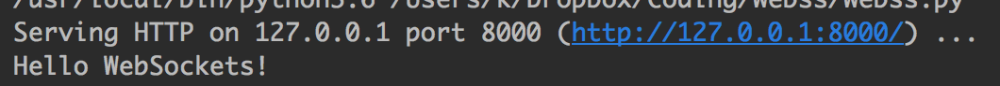
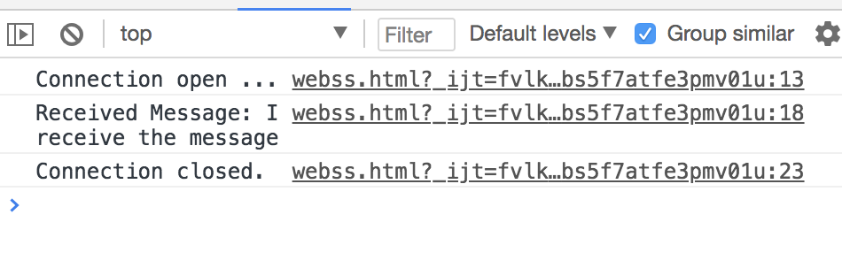

# Webss


A websocket protocol-based server-side script.

# Reference

[The WebSocket Protocol](https://tools.ietf.org/html/rfc6455)

[Websocket(zh.wikipedia.org)](https://zh.wikipedia.org/wiki/WebSocket)

# Usage

Websocket protocol based on websocket handshake communication.

Through the inheritance `BaseWSRequestHandler` class and overrides the `method` method. 
Use the `do_Send` method to send data. Use the `do_Receive` method to receive data

##### python code

```python
import sys
from Webss.webss import BaseWSRequestHandler
from socketserver import ThreadingTCPServer

class SimpleWSRequestHandler(BaseWSRequestHandler):
    def method(self):
        print(self.do_Receive())
        self.do_Send('I receive the message')

def test(HandlerClass=SimpleWSRequestHandler, protocol="HTTP/1.1", port=8000, bind="127.0.0.1"):
    server_address = (bind, port)

    HandlerClass.protocol_version = protocol
    with ThreadingTCPServer(server_address, HandlerClass) as httpd:
        sa = httpd.socket.getsockname()
        serve_message = "Serving HTTP on {host} port {port} (http://{host}:{port}/) ..."
        print(serve_message.format(host=sa[0], port=sa[1]))
        try:
            httpd.serve_forever()
        except KeyboardInterrupt:
            print("\nKeyboard interrupt received, exiting.")
            sys.exit(0)

test()
```

##### javascript code

```javascript
var ws = new WebSocket('ws://127.0.0.1:8000');

ws.onopen = function(evt) {
  console.log('Connection open ...');
  ws.send('Hello WebSockets!');
};

ws.onmessage = function(evt) {
  console.log('Received Message: ' + evt.data);
  ws.close();
};

ws.onclose = function(evt) {
  console.log('Connection closed.');
};
```

Results screenshot



